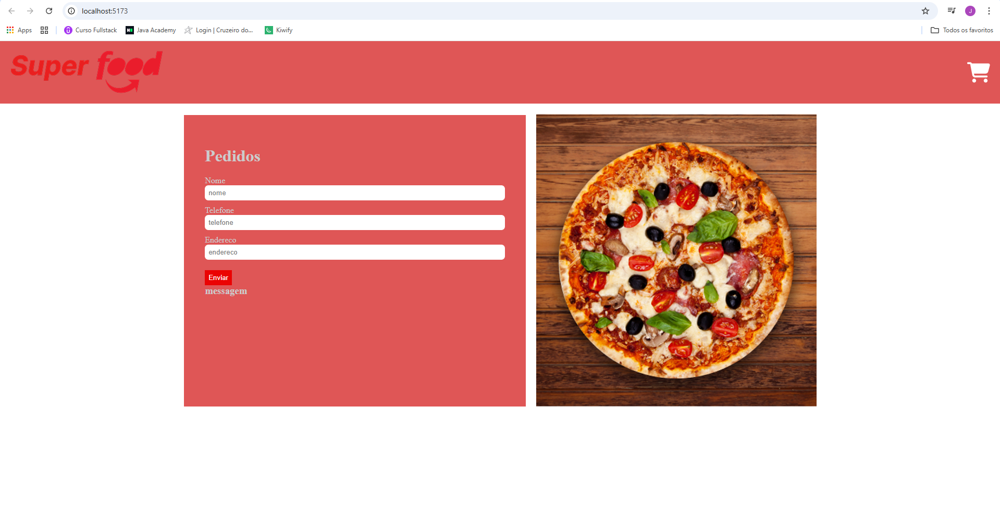

#### ReactJSX

#### Primeira tela

#### Comandos basicos

*npm create vite@latesdt
*cd nomePasta

*npm install
*npm run dev
*npm run build
*cls

#### Comandos Git

*git init

*git add .

#### Comandos usados para atualizar um projeto

* git commit -m update

*git push